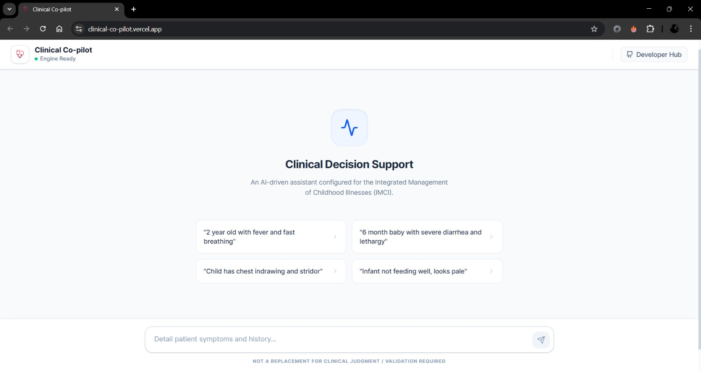
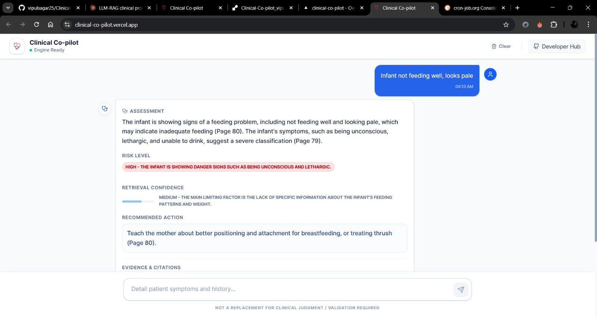
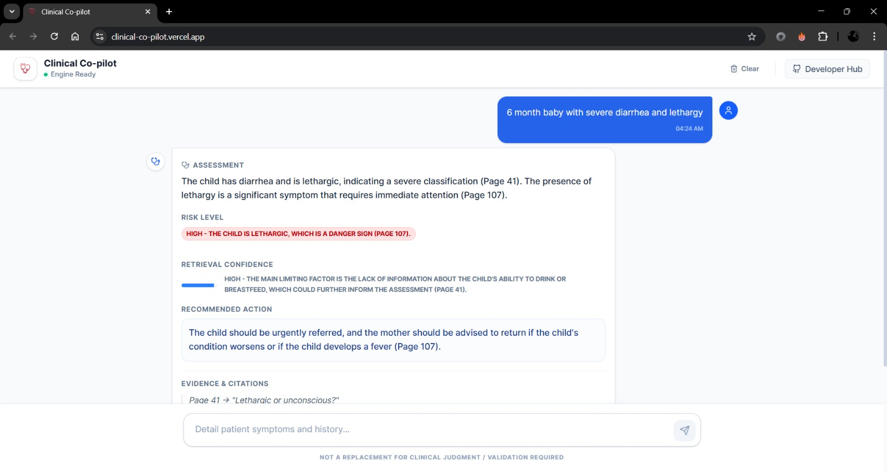

# 🏥 Clinical Co-pilot

> **A full-stack RAG system for clinical decision support — powered by LangChain, Qdrant, Groq, and a React + Vite frontend, deployed on Vercel and Render.**

🔗 **Live Demo**: https://clinical-co-pilot.vercel.app/

---

## 📱 App Showcase

### 🏠 Welcome Screen


### 🏥 Clinical Assessment & Risk Level


### 📚 RAG Evidence & Citations


---

## 🧠 What Is This?

Clinical Co-pilot is an AI-powered clinical assistant that uses **Retrieval-Augmented Generation (RAG)** to answer medical queries grounded in the **IMCI (Integrated Management of Childhood Illness)** handbook. Instead of relying solely on a language model's parametric memory — which can hallucinate — the system retrieves relevant chunks from a curated medical knowledge base at query time, then generates a response anchored to that retrieved context.

This project evolved from [MedGemma](https://github.com/vipulsagar25/MedGemma_project), an earlier exploration of rule-based + LLM hybrid clinical reasoning that used a local Gemma 2B model with ChromaDB. Clinical Co-pilot takes that foundation further:

- **Cloud-accelerated LLM** via Groq (`llama-3.3-70b-versatile`) 
- **Cloud-hosted vector store** on Qdrant Cloud replacing local ChromaDB
- **Fuzzy symptom matching** with RapidFuzz for typo and variant tolerance
- **Confidence scoring** computed from retrieval quality signals (not LLM self-assessment)
- **Multi-layer emergency detection** with IMCI danger sign flagging
- **Document conflict detection** across retrieved chunks
- **Full-stack deployment** with React + Vite on Vercel and FastAPI on Render

---

## 🏗️ System Architecture

```
┌──────────────────────────────────────────────────────────────────┐
│                     React + Vite Client                          │
│            (JSX · Tailwind CSS · Vercel · Port 5173)             │
└────────────────────────────┬─────────────────────────────────────┘
                             │ HTTP / REST (axios)
┌────────────────────────────▼─────────────────────────────────────┐
│                    FastAPI RAG Server                             │
│               (Python · Uvicorn · Render · Port 8000)            │
│                                                                  │
│  ┌─────────────────┐    ┌──────────────────┐    ┌─────────────┐ │
│  │  Query Handler  │───▶│ ClinicalCoPilot  │───▶│  Groq LLM   │ │
│  │   (main.py)     │    │  (rag_engine.py) │    │ llama-3.3   │ │
│  └─────────────────┘    └────────┬─────────┘    └─────────────┘ │
│                                  │ retrieve                      │
│                    ┌─────────────▼──────────────┐               │
│                    │       Qdrant Cloud          │               │
│                    │   (Hosted Vector Store)     │               │
│                    │   Collection: imci_handbook │               │
│                    └────────────────────────────-┘               │
└──────────────────────────────────────────────────────────────────┘
```

---

## ⚙️ How the RAG Pipeline Works

### 1. Document Ingestion (`builders/build_vector_db.py`)

The IMCI handbook PDF is loaded with `PyPDFLoader`, split into overlapping chunks (400 chars, 80 overlap) using LangChain's `RecursiveCharacterTextSplitter`, embedded using **FastEmbed** (384-dim vectors), and uploaded to a **Qdrant Cloud** collection.

```python
# Actual ingestion flow
loader = PyPDFLoader("data/imci_handbook.pdf")
pages = loader.load()
chunks = RecursiveCharacterTextSplitter(chunk_size=400, chunk_overlap=80).split_documents(pages)
vectorstore = Qdrant.from_documents(chunks, FastEmbedEmbeddings(), url=QDRANT_URL, ...)
```

### 2. Patient State Extraction (Deterministic — Zero LLM)

Before any LLM call, the system extracts a structured patient state from conversation history using:

- **Exact substring matching** against 18 IMCI symptom categories with 70+ variant phrases
- **Fuzzy matching** via RapidFuzz (`token_set_ratio ≥ 82`) to catch typos and informal spellings
- **Denial detection** to distinguish "has fever" from "no fever"
- **Age and duration extraction** via regex

```python
# Example: "2 yr old with convulsoin and high temprature" 
# → confirmed: {fever, convulsion}, age: "2 yr old"
# Even with typos, fuzzy matching catches "convulsoin" and "temprature"
```

### 3. Multi-Layer Emergency Detection

Before generating any response, the system checks for IMCI danger signs across three layers:

1. **Layer 1**: Exact keyword scan of the current message
2. **Layer 2**: Fuzzy match against emergency variant phrases
3. **Layer 3**: Confirmed danger signs from prior conversation turns

Any detected danger sign triggers an **immediate referral override** prepended to the response.

### 4. Dual-Pass Retrieval with Conflict Detection

The system performs **two independent similarity searches** on Qdrant:

- **Pass A**: Direct user query → top-K chunks
- **Pass B**: Structured symptom-based query (`"IMCI classification child with fever, cough aged 2 years"`) → top-K chunks

Results are merged, deduplicated by content hash, and filtered by a cosine distance threshold (≤ 0.5). A **conflict detector** scans retrieved documents for clashing risk signals (e.g., "severe" + "mild") and flags them for the LLM to resolve conservatively.

### 5. Confidence Scoring (Pre-Computed, Not LLM-Generated)

Retrieval confidence is scored on a 0-100 scale using objective signals:

| Factor | Impact |
|---|---|
| ≥ 3 docs retrieved | +15 |
| Strong semantic match (score ≤ 0.6) | +10 |
| ≥ 2 IMCI keywords in retrieved docs | +10 |
| Patient age confirmed | +10 |
| Symptom duration known | +5 |
| Document conflict detected | −20 |
| Fuzzy-only matches (no exact) | −15 |
| No confirmed symptoms | −10 |

The resulting label (High / Medium / Low) is **passed to the LLM** — the LLM echoes it, not invents it.

### 6. Structured LLM Response

The Groq LLM (`llama-3.3-70b-versatile`, temperature=0) generates responses in a strict 6-section format:

1. **Assessment** — with IMCI page citations
2. **Risk Level** — High / Moderate / Low
3. **Confidence** — echoed from pre-computed score
4. **Recommended Action** — IMCI-guided with page citation
5. **Evidence** — direct quotes (< 15 words) with page numbers
6. **Key Questions** — max 2 unconfirmed, clinically necessary

---

## 🛠️ Tech Stack

| Layer | Technology |
|---|---|
| **LLM Inference** | Groq API (`langchain-groq`) — `llama-3.3-70b-versatile` |
| **RAG Orchestration** | LangChain Core + LangChain Community |
| **Vector Store** | Qdrant Cloud (`langchain-qdrant`, `qdrant-client`) |
| **Embeddings** | FastEmbed (384-dimensional vectors) |
| **Fuzzy Matching** | RapidFuzz (token-set ratio for symptom detection) |
| **Document Parsing** | PyPDFLoader (LangChain Community) |
| **Backend Server** | FastAPI + Uvicorn (async Python) |
| **Frontend Client** | React 19 + Vite 7 + Tailwind CSS 4 |
| **Frontend UI** | Lucide React (icons), Axios (HTTP) |
| **Deployment** | Vercel (frontend) + Render (backend) |

---

## 📁 Project Structure

```
Clinical-Co-pilot/
│
├── client/                          # React + Vite frontend
│   ├── src/
│   │   ├── App.jsx                  # Main chat interface with clinical response parsing
│   │   ├── index.css                # Tailwind-based clinical design system
│   │   ├── main.jsx                 # React entry point
│   │   └── assets/                  # Static assets
│   ├── public/
│   │   ├── logo1.png                # App logo / favicon
│   │   └── logo.jpeg                # Alternate logo
│   ├── index.html                   # HTML entry point
│   ├── vite.config.js               # Vite + Tailwind plugin config
│   └── package.json                 # React 19, Vite 7, Tailwind 4, Axios, Lucide
│
├── server_rag/                      # Python RAG backend
│   ├── api/
│   │   └── main.py                  # FastAPI app — /chat and /health endpoints
│   ├── app/
│   │   └── rag_engine.py            # Core RAG pipeline (683 lines):
│   │                                #   - Fuzzy symptom matching (RapidFuzz)
│   │                                #   - Deterministic patient state extraction
│   │                                #   - Multi-layer emergency detection
│   │                                #   - Dual-pass retrieval + deduplication
│   │                                #   - Confidence scoring (retrieval-based)
│   │                                #   - Document conflict detection
│   │                                #   - Structured prompt construction
│   ├── builders/
│   │   └── build_vector_db.py       # PDF → chunk → embed → Qdrant upload script
│   ├── data/
│   │   └── imci_handbook.pdf        # Source clinical document (IMCI handbook)
│   ├── storage/
│   │   └── vector_store/            # Legacy local ChromaDB (now using Qdrant Cloud)
│   └── requirements.txt             # Python dependencies (pinned)
│
├── .env                             # Environment variables (gitignored)
├── .gitignore
├── .python-version                  # Python version specification
└── README.md
```

---

## 🚀 Getting Started

### Prerequisites

- Python 3.11+
- Node.js 18+
- A [Groq API key](https://console.groq.com/) (free tier available)
- A [Qdrant Cloud](https://cloud.qdrant.io/) cluster (free tier available)

### 1. Clone the Repository

```bash
git clone https://github.com/vipulsagar25/Clinical-Co-pilot.git
cd Clinical-Co-pilot
```

### 2. Set Environment Variables

Create a `.env` file in the project root:

```env
GROQ_API_KEY=your_groq_key_here
QDRANT_URL=https://your-cluster.cloud.qdrant.io
QDRANT_API_KEY=your_qdrant_key_here
VITE_API_BASE_URL=http://localhost:8000
```

### 3. Backend Setup

```bash
cd server_rag

# Create and activate a virtual environment
python -m venv venv
source venv/bin/activate        # Linux/Mac
# venv\Scripts\activate          # Windows

# Install dependencies
pip install -r requirements.txt
```

### 4. Ingest the IMCI Handbook

Build the vector store by embedding the handbook and uploading to Qdrant:

```bash
cd builders
python build_vector_db.py
```

This will chunk, embed (FastEmbed 384-dim), and upload all document chunks to your Qdrant Cloud collection (`imci_handbook`).

### 5. Start the Backend Server

```bash
cd ../
uvicorn api.main:app --host 0.0.0.0 --port 8000 --reload
```

API will be live at: `http://localhost:8000`  
Interactive docs: `http://localhost:8000/docs`

### 6. Start the Frontend Client

```bash
cd ../client
npm install
npm run dev
```

Client will be live at: `http://localhost:5173`

---

## 🔑 Environment Variables

| Variable | Description | Required |
|---|---|---|
| `GROQ_API_KEY` | API key for Groq LLM inference | ✅ Yes |
| `QDRANT_URL` | Qdrant Cloud cluster URL | ✅ Yes |
| `QDRANT_API_KEY` | Qdrant Cloud API key | ✅ Yes |
| `VITE_API_BASE_URL` | Backend URL for the React client | ✅ Yes |

---

## 📊 Key Design Decisions

### Why Groq over local models?

The earlier MedGemma project ran Gemma 2B locally — functional, but slow for iteration. Groq's inference hardware delivers sub-second latency on `llama-3.3-70b-versatile`, which is essential for a responsive clinical tool. The 70B model also produces significantly better structured clinical reasoning than 2B.

### Why Qdrant Cloud over local ChromaDB?

The MedGemma project used local ChromaDB. For deployment on Render (which has ephemeral storage), a cloud-hosted vector store was necessary. Qdrant Cloud provides persistent storage, horizontal scaling, and cosine similarity search out of the box.

### Why pre-computed confidence instead of LLM self-assessment?

LLMs are notoriously bad at calibrating their own confidence — they can sound certain while being completely wrong. Clinical Co-pilot computes a confidence score from **objective retrieval signals** (document count, semantic match quality, IMCI keyword density, patient data completeness) and passes the label to the LLM. The LLM echoes it, not invents it.

### Why RapidFuzz for symptom matching?

Real users (parents, community health workers) type symptoms with misspellings, informal language, and phonetic approximations. RapidFuzz's `token_set_ratio` catches variants like "convulsoin" → "convulsion" and "eyes red" → "red eyes" without false positives on short words.

### Why dual-pass retrieval?

A single query pass may miss relevant IMCI guidelines if the user describes symptoms informally. Pass A searches with the raw user query; Pass B constructs a formal IMCI-style query from extracted symptoms. Merging both passes improves recall significantly.


---

## ⚠️ Disclaimer

This is a **research and learning project**. Clinical Co-pilot is **not a certified medical device** and is **not approved for use in real patient care**. All responses should be treated as informational and reviewed by qualified clinicians before any clinical application.

Do not use this system to make or inform actual medical decisions without proper validation, regulatory review, and clinician oversight.

---

## 👨‍💻 Author

**Vipul Sagar** — Built as part of a self-directed learning journey into LLMs, RAG systems, and applied AI for healthcare.

- GitHub: [@vipulsagar25](https://github.com/vipulsagar25)

---

## 📄 License

This project is open source and available under the [MIT License](LICENSE).
